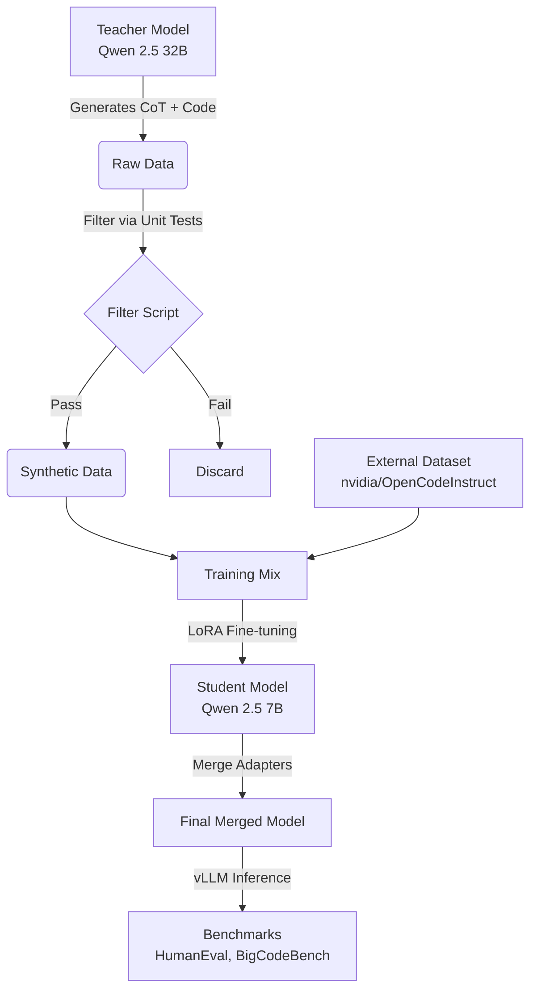

# DistilCoder

DistilCoder is a knowledge distillation pipeline designed to train a smaller "Student" model (Qwen 2.5 Coder 7B) to mimic the reasoning capabilities of a larger "Teacher" model (Qwen 2.5 Coder 32B).

## Architecture

The pipeline consists of four main stages:



1.  **Generation**: The Teacher model generates solutions with Chain-of-Thought (CoT) reasoning for the MBPP dataset.
2.  **Filtration**: Generated code is executed against unit tests in a sandboxed environment. Only correct solutions are kept.
3.  **Training**: The Student model is fine-tuned on a mix of high-quality synthetic data (reasoning) and large-scale instruction data (general coding skills).
4.  **Evaluation**: The final model is evaluated against standard benchmarks using vLLM.

## Setup

### Prerequisites
- Linux environment with SLURM (Cluster).
- NVIDIA GPU (H200/A100 recommended) with CUDA 12.1 support.
- Anaconda/Miniconda.

### Installation

1.  **Environment Setup**
    ```bash
    # Load CUDA module (Adjust version as needed for your cluster)
    module load cuda/11.8.0/4w5kyjs

    # Create Conda environment
    conda env create -f environment.yaml
    conda activate distil-coder
    ```

2.  **Install Dependencies**
    ```bash
    uv pip install -r requirements.txt --index-strategy unsafe-best-match
    ```

3.  **Hugging Face Token**
    Ensure your Hugging Face token is set up to access gated models or push results.
    ```bash
    # Save it to a file expected by the job scripts:
    echo "your_token_here" > ~/.secrets/hf_token
    ```

## Usage

### 1. Full Training Pipeline
To run the entire pipeline (Generation -> Filtering -> Training), submit the training job:

```bash
sbatch jobs/train.sh
```

This script will:
1.  Run `scripts/generate_data.py` to create `data/raw/teacher_generated.jsonl`.
2.  Run `scripts/filter_data.py` to create `data/processed/filtered_data.jsonl`.
3.  Run `scripts/train_student.py` to fine-tune the student model and save it to `results/final_student_model/merged`.

### 2. Evaluation
Once training is complete, run the evaluation job. You can chain this to the training job ID:

```bash
# Replace 12345 with your training job ID
sbatch --dependency=afterok:12345 jobs/evaluate.sh
```

Or run it manually:
```bash
sbatch jobs/evaluate.sh
```

### 3. Scoring
The evaluation script generates solution files in `results/benchmarks/`. To calculate Pass@1 scores, run `evalplus` on the login node:

```bash
# HumanEval
evalplus.evaluate --dataset humaneval --samples results/benchmarks/humaneval_output.jsonl

# BigCodeBench
evalplus.evaluate --dataset bigcodebench --samples results/benchmarks/bigcodebench_output.jsonl
```

## Configuration

- **Model Configs**: `config/model/` (Student and Teacher settings).
- **Training Configs**: `config/training/finetune.yaml` (Hyperparameters, LoRA rank).